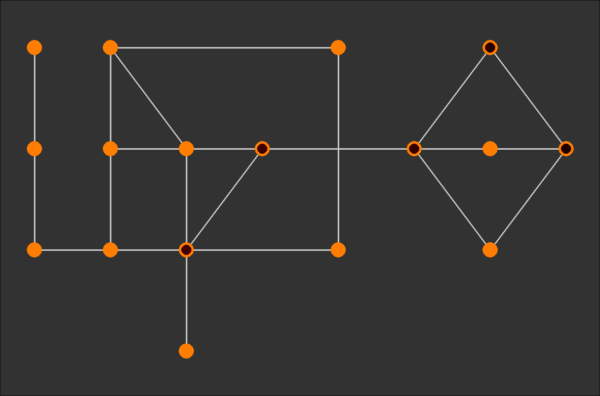

*This project has been created as part of the 42 curriculum by migteixe.*

# Fly-In

## Description

### Overview

Fly-in is a graph-based pathfinding and simulation project from the 42 Common Core curriculum. The program receives a map containing interconnected hubs and a number of drones that must travel from a starting hub to a destination.

The project parses and validates the map, builds a graph, finds suitable routes, and distributes the drones between them to minimise the number of turns required.

A Pygame graphical interface is also included, allowing the graph, routes, and drone movements to be visualised during the simulation.

### Goal

The main goal of the project is to efficiently find and use routes through a network so that all drones reach their destination in the shortest possible time, while respecting the constraints of the graph.

### Features

* Map file interpreter
* Pygame GUI
* Drone scattering accross multiple paths
* Built-in Graph generation and pathfinding

### Technical Choices

This project uses only the external Pygame library to build the 

* **Language:** Python 3.10+
* **Graphics:** Pygame
* **Libraries:** pygame-ce
* **Architecture:** Map parsing -> Graph building -> Pathfinding -> Simulation -> Graphical representation

---

## Instructions

### Requirements

* Python 3.x
* pip
* pygame-ce

### Installation

In order to install this project clone the git repository using the following commands:

```bash
git clone <repository-url>
cd <project-directory>

make install
```

### Execution

To run the project, you can use either one of these commands

```bash
make run <path/to/map>
```
```bash
python3 fly_in.py <path/to/map>
```

### Input Format

* The first line defines the number of drones using ```nb_drones: <number>```.

Zone definition on each line using type prefixes:

* start_hub: ```<name> <x> <y> [metadata]``` marks the starting zone.

* end_hub: ```<name> <x> <y> [metadata]``` marks the end zone.

* hub: ```name> <x> <y> [metadata] defines a regular zone.```

The connection syntax forbids dashes in zone names.
All metadata is optional and enclosed in brackets [...] with default values:

```zone=<type>``` (default: normal)

```color=<value>``` (default: none) - (Colors are being ignored)

```max_drones=<number>``` (default: 1) - Maximum drones that can occupy this zone simultaneously (start_hub and end_hub must not have a maximum ammount of drones)

Tags inside brackets can appear in any order.

**Zone types:**

* normal – Standard zone with 1 turn movement cost (default)

* blocked – Inaccessible zone. Drones must not enter or pass through this zone. Any path using it is invalid.

* restricted – A sensitive or dangerous zone. Movement to this zone costs 2 turns.

* priority – A preferred zone. Movement to this zone costs 1 turn but should be prioritized in pathfinding.

**Connections:**

A connection defines a bidirectional connection (edge) between two zones.

Connections are defined using the ```connection``` tag:

* ```connection: <name1>-<name2> [metadata]```

The connection syntax forbids dashes in zone names.

Optional metadata can be specified in brackets [...]:
* ```max_link_capacity=<number>``` (default: 1) - Maximum drones that can traverse this connection simultaneously

**Comments:**

Comments start with ’#’ and are ignored.

---

## Algorithm

### Overview

This project uses a pathfinding algorithm developed by me. This algorithm first finds out the shortest path from start to end of the graph using a BFS (Breadth-First Search) algorithm, after obtaining this path it will find every path shorter in ammount of turns necessary to reach the goal with a DFS (Depth-First Search) approach, this is accomplished by stopping the exploration of a path as soon as the total weight of the path is equal or superior to the total ammount of weight of the shortest path. After this step, every path found is filtered until only the paths with the minimum ammount of turns possible are left, a trie is generated using these paths and outputted to the simulation where the drones will take the first unoccupied path they find.

---

## Visual Representation

### Overview

The project uses a very rudimentary GUI, used only to show the user the path each drone took.

### Graph Representation

* Nodes are represented by a 30 pixel wide orange circle
* Connections are represented by a 3 pixel wide white straight line, taking the shortest path from node1 to node2

### Drone / Entity Representation

* Drones are represented by a smaller (20 pixel wide) circle in a gradient color palette, where the higher the ID number, the brighter the color

### Visual Feedback

* Every 0.5 seconds a turn is passed, everytime a turn passes the position of every drone is refreshed to the current position.

---

## Example

### Input

```text
nb_drones: 8

start_hub: start 0 0 [color=green]
hub: maze_a1 1 0 [color=blue max_drones=2]
hub: maze_a2 2 0 [color=blue]
hub: maze_b1 1 1 [color=blue]
hub: maze_b2 2 1 [color=blue max_drones=2]
hub: maze_c1 1 2 [color=blue]
hub: maze_c2 3 1 [color=blue max_drones=2]
hub: dead_end1 0 1 [color=red max_drones=2]
hub: dead_end2 0 2 [color=red]
hub: dead_end3 2 -1 [color=red]
hub: trap_loop1 4 0 [zone=restricted color=orange]
hub: trap_loop2 4 2 [zone=restricted color=orange]
hub: bottleneck 5 1 [color=yellow max_drones=2]
hub: final_stretch1 6 0 [zone=priority color=cyan]
hub: final_stretch2 6 1 [zone=priority color=cyan]
hub: final_stretch3 6 2 [zone=priority color=cyan]
end_hub: goal 7 1 [color=green]

connection: start-maze_a1 [max_link_capacity=2]
connection: maze_a1-maze_a2
connection: maze_a1-maze_b1
connection: maze_b1-maze_b2
connection: maze_b2-maze_c2
connection: maze_c2-maze_a2
connection: maze_c2-bottleneck
connection: start-dead_end1 [max_link_capacity=2]
connection: dead_end1-dead_end2
connection: maze_a2-dead_end3
connection: maze_a2-trap_loop1
connection: trap_loop1-trap_loop2
connection: trap_loop2-maze_c1
connection: maze_b1-maze_c1
connection: maze_c1-maze_b2
connection: maze_b2-maze_a2
connection: bottleneck-final_stretch1
connection: bottleneck-final_stretch2
connection: bottleneck-final_stretch3
connection: final_stretch1-goal
connection: final_stretch2-goal
connection: final_stretch3-goal
```

### Expected Output

Terminal Output:
```text
D1-maze_a1 D2-maze_a1 
D1-maze_a2 D3-maze_a1 
D1-maze_c2 D2-maze_a2 D4-maze_a1 
D1-bottleneck D2-maze_c2 D3-maze_a2 D5-maze_a1 
D1-final_stretch3 D2-bottleneck D3-maze_c2 D4-maze_a2 D6-maze_a1 
D1-goal D2-final_stretch3 D3-bottleneck D4-maze_c2 D5-maze_a2 D7-maze_a1 
D2-goal D3-final_stretch3 D4-bottleneck D5-maze_c2 D6-maze_a2 D8-maze_a1 
D3-goal D4-final_stretch3 D5-bottleneck D6-maze_c2 D7-maze_a2 
D4-goal D5-final_stretch3 D6-bottleneck D7-maze_c2 D8-maze_a2 
D5-goal D6-final_stretch3 D7-bottleneck D8-maze_c2 
D6-goal D7-final_stretch3 D8-bottleneck 
D7-goal D8-final_stretch3 
D8-goal 
```

Visual Output:



---

## Resources

https://www.pygame.org/docs/ - pygame documentation

### AI Usage

AI tools were only used in this project to create a template for the README.md file and help generating docstrings for functions, classes and methods